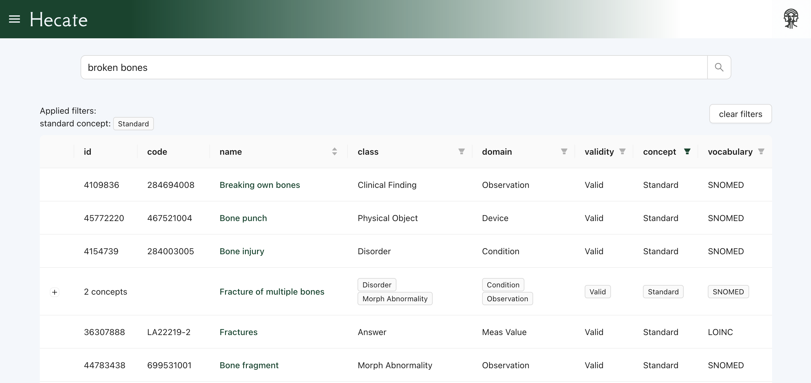

# HECATE 

**Hecate is a semantic search engine for the OHDSI vocabulary**

Try it out [here](https://hecate.pantheon-hds.com)

## Running Hecate locally

**At the moment, it requires some effort (and then some more) to get the full setup running locally.**

You need:

- A Qdrant db populated with the vector embeddings for the concepts you want to be able to find.
- Access to the model with which you generated the embeddings to fetch new embeddings for queries of unknown terms.
- For the concept details page to load, you also need a Postgres db containing the vocabulary.

If there is any interest in a basic docker compose sample setup with some limited demo data please get in touch.

